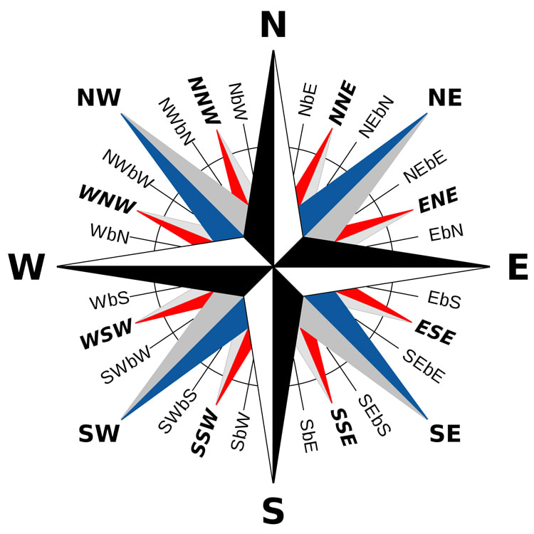

## West by Midwest: Package Maintenance, Transition and Handover

*May 14, 2026* 

:::: {.columns}

::: {.column width="35%"}
<br> 


<br> 
{width=85%}
:::


::: {.column width="65%"}

<br>

### Julia Piaskowski

*Director of Statistical Programs, University of Idaho*

<br>

### Russ Lenth

*Professor Emeritus of Statistics, University of Iowa* 

:::

::::


::: {.r-stack background-color="#343434" .center}

## Julia Piaskowski has recently taken over maintenance of 'emmeans' from Russ Lenth.

<br> <br>

###  How is that going? 


### What challenges have we encountered?

:::

## Emmeans Background

- For estimating marginal means from a linear modeling object
- Legacy package: first released November 5, 2017     
- replacing [**lsmeans**](https://CRAN.R-project.org/package=lsmeans)' (first released August 15, 2012)    
- methods based on Searle, Speed, and Milliken (1980) Population marginal means in the linear model: An alternative to least squares means, *The American Statistician* **34(4)**, 216-221 [doi:10.1080/00031305.1980.10483031](https://doi.org/10.1080%2F00031305.1980.10483031).


::: {.r-stack background-color="#ffcd00" .center}

# Russ' Perspective

:::


## West by Midwest: Where We Are

```{r, fig.align = "center", fig.height = 8}
library(sf)
data(state_boundaries_wgs84, package = "USA.state.boundaries")
attach(state_boundaries_wgs84[state_boundaries_wgs84$TYPE == "Land", ])
pick = function(...) {
    sapply(list(...), \(x) which(STATE_ABBR == x))
}
mix_col = function(col1, col2, frac) {
    x = grDevices::colorRamp(c(col1, col2))(frac) / 255
    rgb(x[1], x[2], x[3], 1)
}
rcol = "cornflowerblue"
jcol = "indianred" 
necol = "lightyellow"
rsec = mix_col(rcol, "white", 0.5)
jsec = mix_col(jcol, "white", 0.5)
ovlap = mix_col(jsec, rsec, 0.5)
#ovlap = mix_col(mix_col(jcol, rcol, 0.5), "white", 0.50)

allstates = Shape[pick("ID", "NE", "IA",   "WA", "MT", "WY", "CO", "NM", "WI")]
allcol = c(jcol, necol, rcol, jsec, ovlap, rep(rsec, 4))
rng = st_bbox(allstates)
plot(allstates[1:3], col = allcol[1:3], xlim = rng[c(1,3)], ylim = rng[c(2,4)],
     mar = rep(0.0, 4))
```

## West by Midwest: Where We've Lived

```{r, fig.align = "center", fig.height = 8}
plot(allstates, col = allcol, mar = rep(0.0, 4))
detach()
```


## Russ's Computing Background

- Skeletran, Fortran IV
- Algorithms for noncentral $F$, beta, and $t$
- Power and sample size
  - Pascal
  - Xlisp-stat
  - Java
- Other R packages: [**rsm**](https://CRAN.R-project.org/package=rsm), [**lsmeans**](https://CRAN.R-project.org/package=lsmeans), [**estimability**](https://CRAN.R-project.org/package=estimability), [**vigindex**](https://github.com/rvlenth/vigindex)


<!--  (Probably omit this slide)

## Teaching and stat software experience

- Experimental design
- Box-Hunter-Hunter, Montgomery, Oehlert texts depending on level
- My emphasis more on industrial quality than social science contexts
- Minitab, later S-Plus, R
- SAS as needed for unbalanced cases
- Varying faculty opinions on essentialness of SAS
- **lsmeans** package not until my last year of teaching (2012--13)

-->


## Origins of 'lsmeans'

- Preliminary thoughts about how to obtain LSmeans focused on interpretation of model coefficients
  - What to do with covariates?
  - Doesn't help that SAS Type III estimable functions do this wrong (IMHO)
- Salary equity analysis for administration
  - Focus on what model *predicts*
  - Duh! Those are the linear functions of coefficients that I need

<!--

## Foundations of least-squares means

- Walter R. Harvey, *Least-squares analysis of data with unequal subclass numbers,* technical report for USDA Agricultural Research Station, undated. Reprinted 2018 by Forgotten Books.
- SAS '72 `PROC HARVEY`; later `LSMEANS` option in some `PROC`s
- Searle, Speed, and Milliken (1980), *The American Statistician*
- Closely related but essential: Estimability
  - Rank-deficiency $\Rightarrow$ some predictions not unique
  - Now in **estimability** package, wish more people paid attention to this


## Reference grid

- Defined implicitly in papers, but doing so explicitly helps to understand what we are talking about
- Identify levels of each (fixed) factor in the model
- Mean of each covariate (by default)
  - Alternatively, can specify one or more covariate values of interest
- All combinations of these factor and covariate levels
- With nested fixed effects, treat each nest as a single factor

## Formulation of least-squares means

- Predictions on a reference grid
  - or equally-weighted marginal means thereof
- In absence of covariates, this is essentially unweighted means analysis
- In presence of covariates, we have covariate-adjusted means or averages thereof
- If any of the predictions involved are non-estimable, then so are the LSMs

-->

## Differing Application Perspectives

- LSMs use *equal weighting*
- Makes sense to experimenters
- Others who deal with observational data, not so much
- Alernative weighting: Proportional, Outer, Flat
- Causal effects: *G* computation (counterfactuals)
- Other packages or platforms: *Stata*, **effects**, **marginaleffects**, **margins**

## emmeans (2017--)

- Re-structure of **lsmeans** with improved architecture and class structure, customizability
- Expanding to generalized linear models, link functions and response transformations
- Version 2.0.3 has 45 source files (17,500 lines)
  - 9,700 lines of R code
  - 7,800 lines of comments or embedded documentation
- 243 functions (79 public), 16 vignettes
- 121 reverse depends/imports/suggests/enhances


## Getting into R package development

-   My first R package was **rsm**
-   I had existing code that worked, and used `package.skeleton()` function 
    (still available) to bundle it up
    -   But this required writing separate `Rd` files, etc.
-   Now the way to go is to use RStudio (or Positron) -- free download --
    and create a new project
-   Use **roxygen2** package to incorporate documentation, imports, etc.
-   Wickham, H and Bryan, J (2023) *R Packages* (2d ed), O'Reilly Media, Inc.

## Observations on package development

-   Writing code is fun
-   Writing documentation & vignettes is less fun, and time-consuming. But really important
-   Your stuff is there for others to see -- and they will look

## My pet peeves with some other people's packages

-   Cramped,runtogethercode. Use whitespace
-   Over-abstraction. Use meaningful (but short) variable names
-   Re-using the same variable or object name in a string of examples

#### Bug reports

- Same peeves, also unnecessary elaboration


## Transition experience

- Julia ...
  - encouraged me to add **pkgdown** site (July '24)
  - set up GitHub action to update site automatically
  - started monitoring the Issues page
  - began answering some issues
  - major overhaul graphics theme
  - took over as official maintainer (August '25, version 2.0.0)

## Transitioning = Stress of change + Benefits

- 'pkgdown' as mentioned before
- Different work habits & availability
- Repo management -- working in branches
- Coding style (e.g., I like "`=`" rather than "`<-`")
  - but similar styles with whitespace and indentation
- Joint responsibility for decisions (e.g., no "stars")

-----------------------------------------------------------------

::: {.r-stack background-color="#FDDC5C" .center}

# Julia's Perspective

:::

## Programming Background

::: {.incremental}

- Originally trained in SAS    
- Started using R in 2010 when I was unable to access all the predictions from `PROC PLS` (SAS v9.3)   
- R in those days was hard (no tidyverse, ggplotting, or RStudio), but it had enough functionality and flexibility to make it worth the effort.   
- Learned C, python, bash shell scripting. Programming is satisfying! 
- I pay attention to developements in the R ecosystem and read source code frequently.
:::

## Programming Philosophy

::: {.incremental}
- I have an interest in clean code: functions with a clear (single) purpose, good error catching and informative messages. Don't go overboard on functionality (a function is not a multi-tool) 
- Style: code needs to breathe! We aren't bit packing code and sending it to the moon, so use whitespace. Indent code (to indicate function nesting) because it's easier to read and understand 
- Use existing libraries for package enhancement (e.g. '[pbkrtest(https://CRAN.R-project.org/package=pbkrtest )]' for Kenward-Rogers degrees of freedom), but try to limit software dependencies that are required for yours to run.
:::

-----------------------------------------


## Daily CRAN Downloads

```{r}
#| message: false
#| warning: false
library(ggplot2); library(dplyr)
library(cranlogs)

# Get downloads for the last month
stats <- cran_downloads(packages = "emmeans", from = "2017-11-15", to = Sys.Date()) |> 
  filter(count < 10000)

ggplot(stats, aes(x = date, y = count)) +
  geom_line() +
  geom_smooth(method = "loess", span = 0.1, color = "red", fill = "red3", alpha = 0.6, formula = y~x) + 
  xlab(NULL) + ylab(NULL) +
  labs(caption = "Data from 'cranlogs' and checked with 'packageRank'") + 
  #geom_vline(xintercept = as.Date("2022-09-05"), color = "blue") + # date when there is a big shift
  theme_minimal(base_size = 15)
```

```{r}
#| eval: false
#| include: false
library(packageRank)

stats2 <- cranDownloads(package = "emmeans", from = "2017-11-15", to = Sys.Date())[[2]] |> 
  filter(count < 10000)

full_join(stats, stats2, by = "date") |>  
  summarise(corr = cor(count.x, count.y, use = "pairwise.complete.obs")) # these are identical
```


## More Usage/Popularity Stats

- Downloads: 6,000 daily downloads
- Reverse dependencies: 207
- Code Mentions on GitHub: 21,600
- Citations: ?????
- GitHub Stars: 414
- Contributors: 17
- Issues filed: 532

::: {.custom-footer}
**Source:** [ROpenSci's R Universe](https://r-universe.dev/packages)
:::

--------------------------------------------------

:::: {.columns}

::: {.column width="70%"}
```{r}
#| echo: false
#| eval: true
# remotes::install_github("DataKnowledge/DependenciesGraphs")
library(DependenciesGraphs)

suppressPackageStartupMessages(library(emmeans))
dep <- funDependencies("package:emmeans","emmeans")
plot(dep)
```
:::

::: {.column width="30%"}

<br>
<br>

### emmeans Function Dependency Graph

:::

::::

## There is Not Much Guidance on Library Handoff 


{fig-align="center"}


## How Did It Start? (Julia)

::: {.incremental}
1. I filed an issue in 2024 (to make 'pkgdown' website) and assisted with implementing it, realized Russ was 77 years old, and inquired about package succession.
2. I did not contribute much for the next year; I answered issues, and looked more into package functionality.
3. I became more involved starting last August with some encouragement from Russ ("Could you address this...?")
:::

## How Did I Find My Way? {.smaller .scrollable}

::: {.incremental}
- **Step zero**: read about package maintenance tools (e.g [**devtools**](https://CRAN.R-project.org/package=devtools), [**lintr**]( https://CRAN.R-project.org/package=lintr), [styler](https://CRAN.R-project.org/package=styler), [CRAN guides](https://cran.r-project.org/), [*R Packages*](https://r-pkgs.org/) $2^{nd}$, and [R OpenSci recommendations](https://devguide.ropensci.org/index.html). This can be intimidating.

- **Step one**: answer issues to understand how the userbase interacts with the package, what problems do exist, and learn how to respond to different types of requests.  

- **Step two**: make an easy package fixes or improvements (e.g. replace `aes_` with `aes`) and learn how to test them. Learn how to use [**testhat**](https://testthat.r-lib.org/) and write a unit test.

- **Step three**: do more complex fixes: I added functionality for specifying quantile-based credible intervals for Bayesian models in response to a feature request. 

- **Step four**: collaborate with Russ on more complex thing (we overhauled plot aesthetics)
:::

## Challenges: Filed Issues {.smaller .scrollable}

*Some requests:*

- Can you enable users to adjust the number of significant digits when reporting p-values?
- Can you make a cheat sheet?
- Can you add ANOVA for Bayesian models?
- Can you enable credible intervals for Bayesian models? 
- Can you fix this bug where the back transformation is wrong?
- Can emmeans support {this package}? 
- Can you alter your internal function structure so it returns answers identical to my manual calculations?
- I keep getting this ggplot error; thought you might want to know!
- How should I report my results from emmeans?

<center> **How do I respond? ** </center>


## Challenges: Breaking Dependencies
*Internal or external*

::: {.incremental}

- Some issues are complex. The problem might be straightforward to describe, but what it is causing it is not easy to resolve ([example](https://github.com/rvlenth/emmeans/issues/540{preview-link="true"}).    
- Fixing one issue may introduce new problems in the package ([example](https://github.com/rvlenth/emmeans/issues/571){preview-link="true"})      
- Many packages depend on emmeans, so every change has to be weighed with that in mind. What if I break something?          
- We have a script to check for breaking dependencies. But be careful, if something is broken downstream, that will be our problem. 

:::

## Collaboration


## Collaboration 

::: {.incremental}

- We are collaborating two levels: package maintenance and everyday git issues      
- Provide transition tools: guides to package structure, how to prepare for CRAN        
- Clarify expectations: who is addressing what issue and how?         
- Need clear two-way communication (we email each other frequently)        
- Make changes as pull requests (PR's) and request code review           
- Pave the way to easy "wins"    
- Patience, kindness, and encouragement will go a long ways    
:::

## Can I Fill Russ' Shoes? {.smaller}

:::: {.columns}


::: {.column width="50%" .incremental}

- I am learning the codebase, but logically, the original author will know it best. 
- Most of the time, I will not be as timely in my response to filed issues.
- I have to be timely responding to CRAN requests.
- I do want to make a few changes: expand the number of unit tests, expand options for ordinal models, add continuous integration tools for standard checks (`R CMD CHECK`) and unit tests as a GitHub action.

:::

::: {.column width="50%"}


:::

::::


## Final Thoughts: How to Do Library Handoff {.smaller}

::: {.incremental}

- Most of package maintenance is answering issues     
- Some programming skill is needed, but more to read code than write it   
- Considerable patience with git and GitHub is required alongside careful coordination with co-maintainers     
- LLMs: can help with understanding codebase, but an agent (semi-autonomous) is an unwise choice at this time until there is more confidence with the codespace
- Newer developers need nuturing and encourgement (or at least no discouragement) and some easy "wins" early on
:::

---------------------------------------------------


-----------------------------------------------------------

:::: {.columns}

::: {.column width="60%"}

](images/dependency.png)

:::

::: {.column width="40%"}

### Thoughts on Open Source Software
:::

::::

## How to Get Involved

*The open source software universe needs you!*

- Some authors struggle to keep up with demand (see the 200+ issues currently open in [glmmTMB](https://github.com/glmmTMB/glmmTMB/issues))
- Popular packages are abandoned regularly when the original author no longer has time. Any package ever on CRAN is available in a [public archive](https://cran.r-project.org/). 
- There are many opportunities; ROpenSci runs a '[Help Wanted](https://devguide.ropensci.org/index.html)' page with requests for help in solving issues or looking for new maintainers


::: {.r-stack .center background-gradient="linear-gradient(to bottom, #ffcd00, #FDDC5C)"}

# Thank You

:::

## Why SAS Type III Anova is wrong
*(when covariates are involved)* 

```{r, echo = TRUE, message = FALSE}
library(emmeans)
fiber.add = lm(strength ~ diameter + machine, data = fiber) # why have this? 
fiber.int = lm(strength ~ diameter * machine, data = fiber)

emmeans(fiber.add, "machine") |> contrast("consec") |> test(joint = TRUE)

emmeans(fiber.int, "machine") |> contrast("consec") |> test(joint = TRUE)

# What SAS type III ANOVA does
emmeans(fiber.int, "machine", at = list(diameter = 0)) |> 
    contrast("consec") |> test(joint = TRUE)
```

## SAS compares intercepts, not LSmeans

```{r, fig.width = 8}
newdat = expand.grid(diameter = c(0, 24.133), machine = LETTERS[1:3])
newdat$pred.add = predict(fiber.add, new = newdat)
newdat$pred.int = predict(fiber.int, new = newdat)
emmip(fiber.int, machine ~ diameter, at = list(diameter = c(-1,32))) + 
    ggplot2::geom_point(data = newdat, ggplot2::aes(x = diameter, y = pred.int), size = 3)
```

## Confirming SAS's output {.smaller}

#### With model equivalent to `fiber.int`
```
Source                     DF    Type III SS    Mean Square   F Value   Pr > F
diameter                    1    171.1192314    171.1192314     61.00   <.0001
machine                     2      2.6641625      1.3320812      0.47   0.6367
diameter*machine            2      2.7371774      1.3685887      0.49   0.6293
```
*(`machine` result matches joint test of intercepts)*
<br>

#### With `diameter` centered:
```
Source                     DF    Type III SS    Mean Square   F Value   Pr > F
ctr_diam                    1    171.1192314    171.1192314     61.00   <.0001
machine                     2     15.7906794      7.8953397      2.81   0.1124
ctr_diam*machine            2      2.7371774      1.3685887      0.49   0.6293
```
*(`machine` result matches joint test of LSmeans)*

<br>

**Lesson**: In SAS, if you have covariates that interact with anything, center (or standardize) them first
